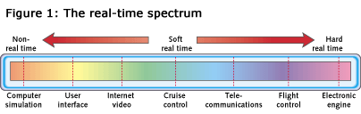

# read01e
Embedded.com: Introduction to Real Time

> Real-time comes in various flavors. This article is an introduction to the different varieties, as well as an exploration of important related concepts.

Many embedded systems can be characterized as real time. A real-time system is one in which the correctness of the computations not only depends on their logical correctness, but also on the time at which the result is produced. In other words, a late answer is a wrong answer.

As an example of a real-time system, consider a computer-controlled machine on the production line at a bottling plant. The machine's function is simply to cap each bottle as it passes within the machine's field of motion on a continuously moving conveyor belt. If the machine operates too quickly, the bottle won't be there yet. If the machine operates too slowly, the bottle will be too far along for the machine to reach it. Stopping the conveyor belt is a costly operation, because the entire production line must correspondingly be stopped. Therefore, the range of motion of the machine coupled with the speed of the conveyor belt establishes a window of opportunity for the machine to put the cap on the bottle.

### Deadline driven
This window of opportunity imposes timing constraints on the operation of the machine. Applications with these kinds of timing constraints are considered real time. In this case, the timing constraints are in the form of a period and deadline.

The period is the amount of time between each iteration of a regularly repeated task. Such repeated tasks are called periodic tasks. Suppose bottles pass under the machine at a rate of five per second. This means a new bottle shows up every 200ms. Thus, the period of the task is 200ms. Note that whether bottles pass once per second or 100 times per second, it doesn't change the fact that this is a real-time system. Real time does not mean fast; it means that a system has timing constraints that must be met to avoid failure.

The deadline is a constraint on the latest time at which the operation must complete. Suppose the window of opportunity is 150ms. The deadline is then 150ms after the start time of the operation. In our example, the start time is defined as the moment the bottle enters the range of the machine. This bottle example has physical constraints, namely the speed of the conveyor belt and the machine's range of motion, that dictate the period and deadline of the task.

In many real-time systems, the period is a design parameter. Consider a cruise control mechanism on an automobile. The basic operation of cruise control is to keep the speed of the vehicle constant. Suppose the driver selects 60mph as the desired speed. If the vehicle is going slower than 60mph, then the embedded computer sends a signal to the engine controller to accelerate. If the vehicle is going faster than 60mph, it sends a signal to decelerate. A question to ask is: how often does the computer check if the current speed is too slow or too fast? The answer is called the control rate (or frequency). It is defined by the control system designer, who will try to find a rate that is fast enough to meet specifications, but not so fast that it adds unnecessary cost to the system. The period is then the reciprocal of the rate (that is, period = 1/rate). The deadline is typically the beginning of the next cycle of a periodic task, because, to start the new cycle, it needs to be finished with the old one.

Communication systems also have real-time constraints. Suppose a multimedia application needs to compress video data at a rate of 30 frames per second. Before it processes a new frame, it needs to finish processing the old frame, otherwise data might get lost in the form of dropped frames. The period of such a task is the frame rate. Processing the old frame must complete before processing on the new frame can begin. Therefore, the deadline is the beginning of the next frame.

### Aperiodic tasks
Not all real-time tasks are periodic. Aperiodic tasks, also called aperiodic servers, respond to randomly arriving events. Consider anti-lock braking. If the driver presses the brake pedal, the car must respond very quickly. The response time is the time between the moment the brake pedal is pressed, and the moment the anti-lock braking software actuates the brakes. If the response time was one second, an accident might occur. So the fastest possible response is desired. But, like the cruise control algorithm, fastest is not necessarily best, because it is also desirable to keep the cost of parts down by using small microcontrollers. What is important is for the application requirements to specify a worst-case response time. The hardware and software is then designed to meet those specifications.

Note that many aperiodic tasks can be converted to periodic tasks. This is basically the same transformation as converting an interrupt handler to a polling task. Instead of reacting to an external event the moment it occurs, the software polls the external input regularly, perhaps tens or hundreds of times per second. If the awaited event is detected, the appropriated computation is enacted.

### Hard or Soft?
A real-time system can be classified as either hard or soft. The distinction, however, is somewhat fuzzy. As illustrated in Figure 1, the meaning of real-time spans a spectrum. At one end of the spectrum is non-real- time, where there are no important deadlines (meaning all deadlines can be missed). The other end is hard real-time, where no deadlines can be missed. Every application falls somewhere between the two endpoints.

A hard real-time system is one in which one or more activities must never miss a deadline or timing constraint, otherwise the system fails. Failure includes damage to the equipment, major loss in revenues, or even injury or death to users of the system. One example of a hard real-time system is a flight controller. If action in response to new events is not taken within the allotted time, it could lead to an unstable aircraft, which could, in turn, lead to a crash; by no standard is this acceptable.

In contrast, a soft real-time system is one that has timing requirements, but occasionally missing them has negligible effects, as application requirements as a whole continue to be met. Consider again the cruise control application. Suppose the software fails to measure current velocity in time for the control algorithm to use it. The control algorithm can still use the old value, because the amount that the velocity would have changed between the last sample and this sample is so small that it can still operate correctly. Missing several consecutive samples, on the other hand, could be a problem, as the cruise control would likely stop meeting application requirements because it is not able to maintain the desired speed within a proper error tolerance.

### Predictability
Page Introduction to Real Time 3 of 3 Two more terms often used to describe real-time systems are predictable and deterministic. These terms are related, but because they are often interchanged or used improperly (as compared to their official definition in real-time systems theory), they are often a source of confusion.
Real-time systems researchers generally use the term predictable to refer to a system whose timing behavior is always within an acceptable range. The behavior is specified on a system-wide basis, such as "all tasks will meet all deadlines." Generally, the period, deadline, and worst-case execution time of each task need to be known to create a predictable system. An appropriate scheduling algorithm with a corresponding schedulability analysis is used to ensure a system is predictable.
A deterministic system is a special case of a predictable system. Not only is the timing behavior within a certain range, but that timing behavior can be pre-determined. For example, a system can be designed with pre-allocated time slots for each task. Execution for each task occurs only during those time slots. Such a system must have execution time for every task known, as well as no anomalies that might cause deviation from the pre-determined behavior. That is, of course, difficult to achieve. Fortunately, determinism is not essential to build predictable real-time systems.