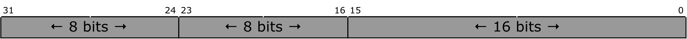

# q03

## 1.
Variable `x` is of type `uint8_t`. Each of the letters `'a'` through `'h'` represents the value of an individual bit that may be $$0$$ or $$1$$. To the right of each row, write a single line of C code that will cause the indicated change.

> **HINT**: Bit positions are numbered from right to left as shown, starting with $$0$$.

(a)

| state | $$7$$ | $$6$$ | $$5$$ | $$4$$ | $$3$$ | $$2$$ | $$1$$ | $$0$$ |
| :-----: | :---: | :---: | :---: | :---: | :---: | :---: | :---: | :---: |
| before | a | b | c | d | e | f | g | h |
| after | b | c | d | e | f | g | h | 0 |

(b)

| state | $$7$$ | $$6$$ | $$5$$ | $$4$$ | $$3$$ | $$2$$ | $$1$$ | $$0$$ |
| :-----: | :---: | :---: | :---: | :---: | :---: | :---: | :---: | :---: |
| before | a | b | c | d | e | f | g | h |
| after | a | b | c | 1 | e | f | g | h |

(c)

| state | $$7$$ | $$6$$ | $$5$$ | $$4$$ | $$3$$ | $$2$$ | $$1$$ | $$0$$ |
| :-----: | :---: | :---: | :---: | :---: | :---: | :---: | :---: | :---: |
| before | a | b | c | d | e | f | g | h |
| after | a | b | c | 0 | e | f | g | h |

## 2.
The packed variable `x` contains 32 bits partitioned as shown below.

**(a)** Assume that `x` is declared to be of type `uint32_t`. Write a single line of C code using __variant access__ to add $$1$$ to the value held in bits 23-16 of `x`.

**(b)** Write a union declaration for `x` that would allow any one of the three fields to be accessed without touching any other part of `x` and without using bit-wise or shift operators.
