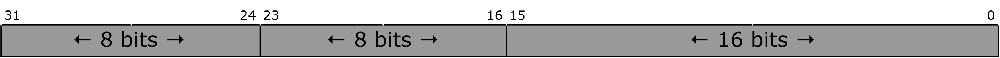

# q03b

## 2.
The packed variable `x` contains 32 bits partitioned as shown below.

**(a)** Assume that `x` is declared to be of type `uint32_t`. Write a single line of C code using __variant access__ to add $$1$$ to the value held in bits 23-16 of `x`.

#### 2(a)
```c
( (uint8_t *) &x)[2] += 1;
```

**(b)** Write a union declaration for `x` that would allow any one of the three fields to be accessed without touching any other part of `x` and without using bit-wise or shift operators.

#### 2(b)
```c
union {
	uint16_t a[2];
	uint8_t b[4]
}
```
